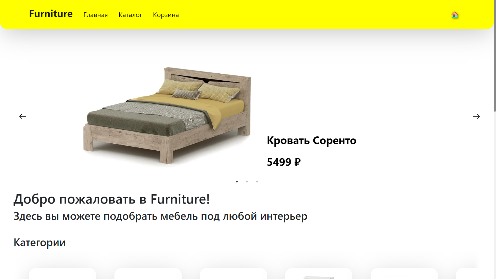
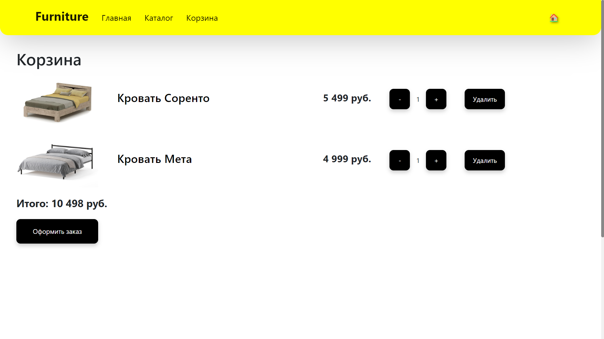
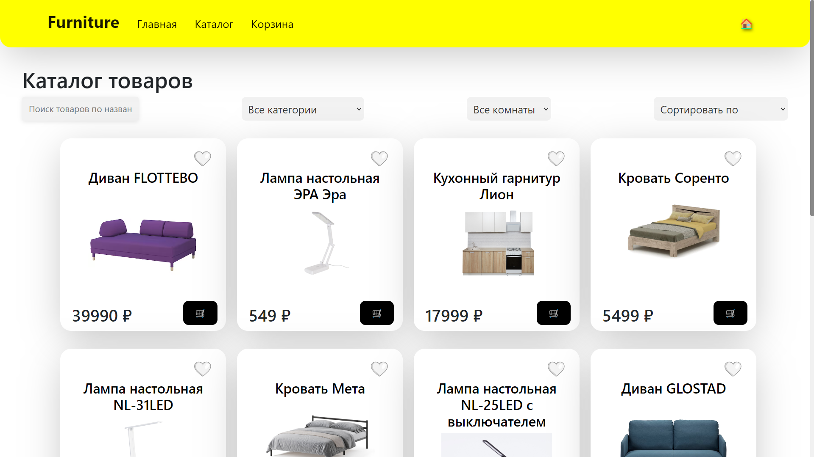
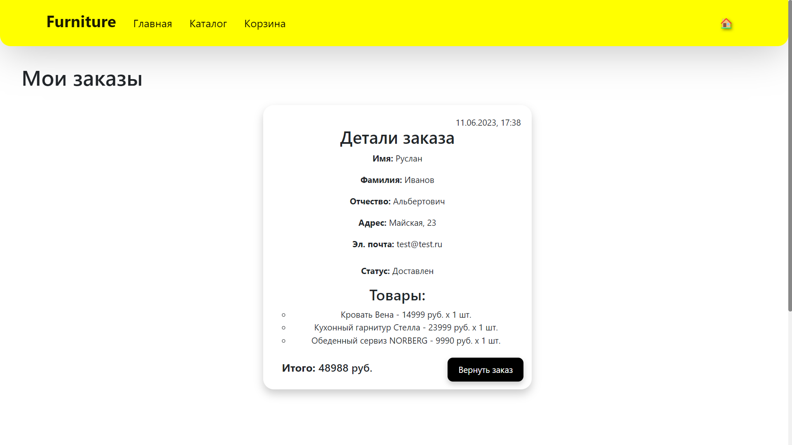
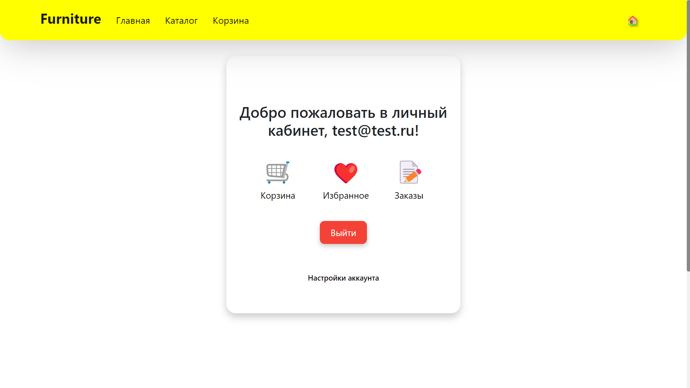

**Онлайн-магазин мебели "Furniture"**

Для разработки современных, масштабируемых и быстрых веб-приложений используется множество технологий и инструментов. В данном проекте используются следующие технологии и фреймворки:

1. Next.js - это фреймворк для разработки серверных приложений на основе React. Он позволяет создавать быстрые и масштабируемые приложения, а также легко реализовывать функции, такие как серверный рендеринг, статическая генерация и маршрутизация на стороне сервера.

2. React - это библиотека JavaScript, которая используется для создания интерактивных пользовательских интерфейсов. Она позволяет создавать компоненты, которые могут быть переиспользованы и облегчает управление состоянием приложения.

3. React DOM - это библиотека JavaScript, которая используется для манипулирования DOM-элементами в React-приложениях.

4. MUI - это фреймворк пользовательского интерфейса на основе React, который предоставляет готовые компоненты и стили для создания красивых и современных пользовательских интерфейсов.

5. Bootstrap - это фреймворк для разработки веб-приложений, который предоставляет готовые компоненты и стили для быстрой и простой разработки пользовательских интерфейсов.

6. Firebase - это платформа для разработки приложений, которая предоставляет инструменты для хранения данных, аутентификации пользователей, отправки уведомлений и других функций.

Примеры работы приложения:

1. Главная страница
   

2. Корзина
   

3. Каталог
   

4. Заказы
   

5. Аккаунт
   

**_Выбор данных технологий обусловлен их мощностью и гибкостью, а также большой популярностью в сообществе разработчиков, что обеспечивает поддержку и постоянное развитие. Кроме того, использование готовых фреймворков и библиотек упрощает и ускоряет процесс разработки, позволяя сосредоточиться на создании уникальных функций приложения._**
